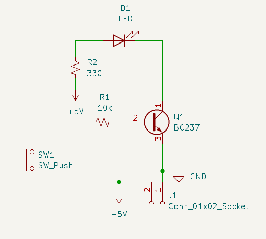
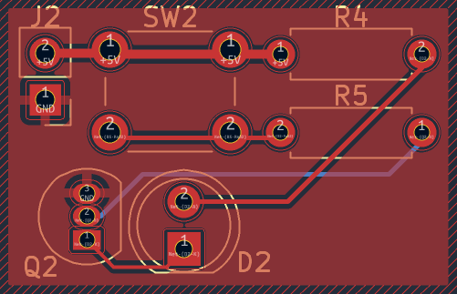
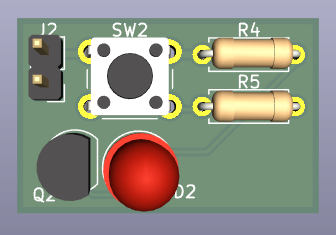

# Transistor LED Driver PCB

## Overview
This project is a simple transistor-based LED driver circuit designed using KiCad.

## Working Principle
When the button is pressed, current flows into the transistor base.
The transistor turns on and allows current to flow through the LED.

## Components
- BC237 Transistor
- LED
- 330Ω resistor
- 10kΩ resistor
- Push button

## Images

### Schematic

### PCB Layout

### 3D View

